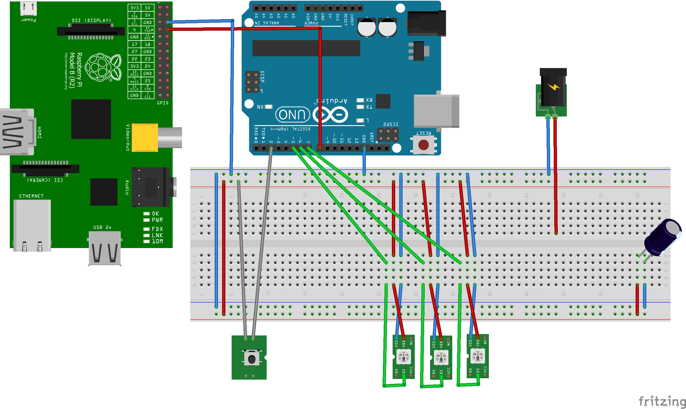

AmbilinoPI
==========

Maps color signals of RaspberryPI to all LED Stripes supported by the [FastLED](http://github.com/FastLED/FastLED) library.

This project uses an Arduino UNO to Map Raspberry PI's Screen output to LED stripes. For detailed documentation take a look at [AmbilinoPI.pdf](Documents/AmbilinoPI.pdf). A basic setup should look like this:

Referenced projects are

[FastLED](http://github.com/FastLED/FastLED) and
[Boblight](http://code.google.com/p/boblight/)
